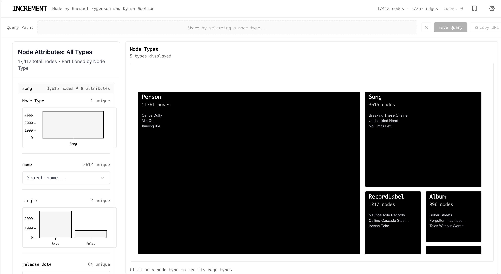

# INCREMENT

INCREMENT is an interactive graph exploration tool that provides a tool for constructing graph queries through a natural, incremental process. 



[**Try the live demo**](https://increment-xi.vercel.app/) · [**Watch the demo video**](https://www.youtube.com/watch?v=V8L0LfLVn7M)

## What Makes INCREMENT Different

Many graph tools require you to write queries ahead of time or show you complicated diagrams. INCREMENT is different: it lets you explore your graph one step at a time, starting with a simple view of all node types. As you click through node types and edge types, the interface shows you the next relevant options, guiding you naturally through the graph.

You don’t need to know the graph’s structure before you start. The interface updates as you go, showing useful details and connections at each step. You can add filters whenever you want, and they will carry forward, making it easy to build complex queries without any code.

## Getting Started

### Installation

Clone the repository and install dependencies:

```bash
git clone https://github.com/yourusername/increment.git
cd increment
npm install
```

### Running Locally

Start the development server:

```bash
npm start
```

The application will open at `http://localhost:3000`.

### Data Format

INCREMENT expects graph data as JSON in the following format:

```json
{
  "nodes": [
    {
      "id": "unique_id",
      "Node Type": "Person",
      "name": "Alice",
      "age": 30
    }
  ],
  "links": [
    {
      "source": "id1",
      "target": "id2",
      "Edge Type": "knows",
      "since": 2020
    }
  ]
}
```

Place your graph data at `public/MC1_graph.json` or modify the data loading path in `src/App.tsx`.

## Architecture

INCREMENT is built with React and D3.js. The application maintains navigation state through a query stack, allowing forward navigation through the graph and backward traversal through history. Filters are scoped to specific query steps, and the entire application state can be serialized to URLs for sharing.

For larger datasets, INCREMENT supports a Cypher backend mode that compiles the incremental query pattern to Cypher queries and executes them against Neo4j. This provides the same interaction model with database-scale performance.

The treemap visualization adapts to different views: node type distributions at the root level, edge type distributions when a node type is selected, and individual node tables when drilling into specific nodes. Attributes are shown contextually in the left panel, updating to reflect the current navigation state.

## Optional: Neo4j Backend

For large graphs, you can use INCREMENT with a Neo4j database:

1. Install and start Neo4j
2. Set environment variables:

```bash
export NEO4J_URI=bolt://localhost:7687
export NEO4J_USER=neo4j
export NEO4J_PASSWORD=your_password
```

3. Ingest your graph data:

```bash
npm run ingest:neo4j
```

4. Enable the Cypher backend:

```bash
export REACT_APP_USE_CYPHER_BACKEND=true
export REACT_APP_NEO4J_URI=$NEO4J_URI
export REACT_APP_NEO4J_USER=$NEO4J_USER
export REACT_APP_NEO4J_PASSWORD=$NEO4J_PASSWORD
npm start
```

INCREMENT will then compile queries to Cypher and execute them against Neo4j transparently.

## Building for Production

Create an optimized production build:

```bash
npm run build
```

The build artifacts will be in the `build/` directory, ready for deployment to any static hosting service.

## Contributing

Contributions are welcome. Please open an issue to discuss significant changes before submitting a pull request.

## Credits

INCREMENT was created by [Racquel Fygenson](https://www.racquelfygenson.com) and [Dylan Wootton](https://x.com/WoottonDylan).

## Questions or Feedback?

For questions, bug reports, or feature requests, please contact [dwootton@mit.edu](mailto:dwootton@mit.edu).

---

Built with React, D3.js, and Neo4j • Licensed under MIT
